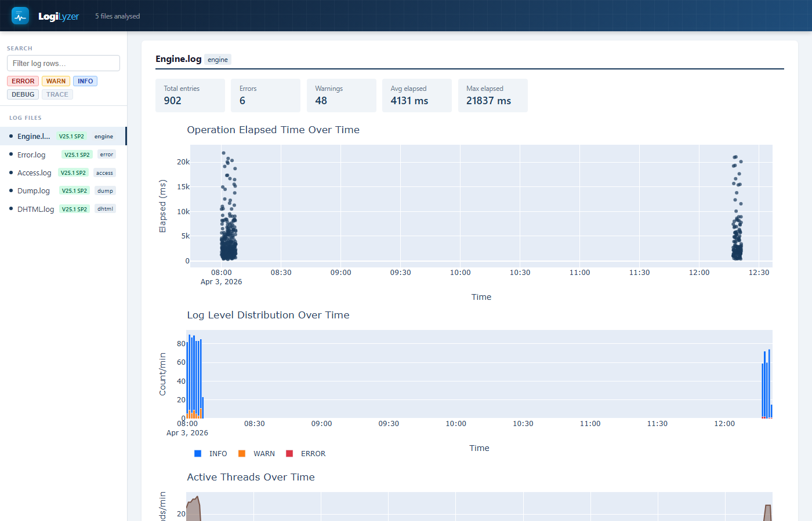
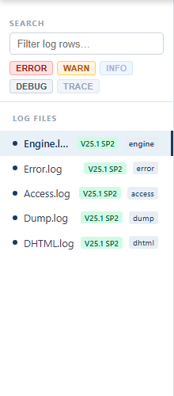
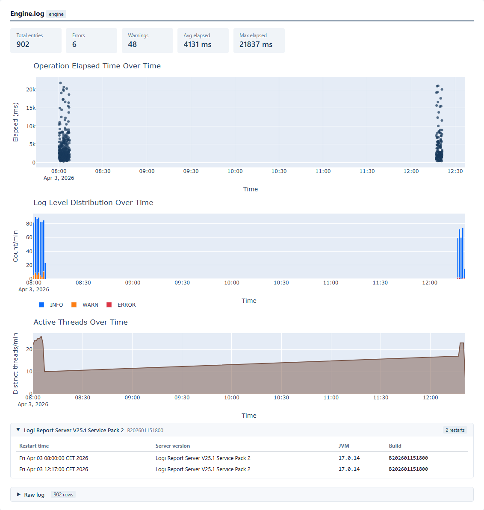
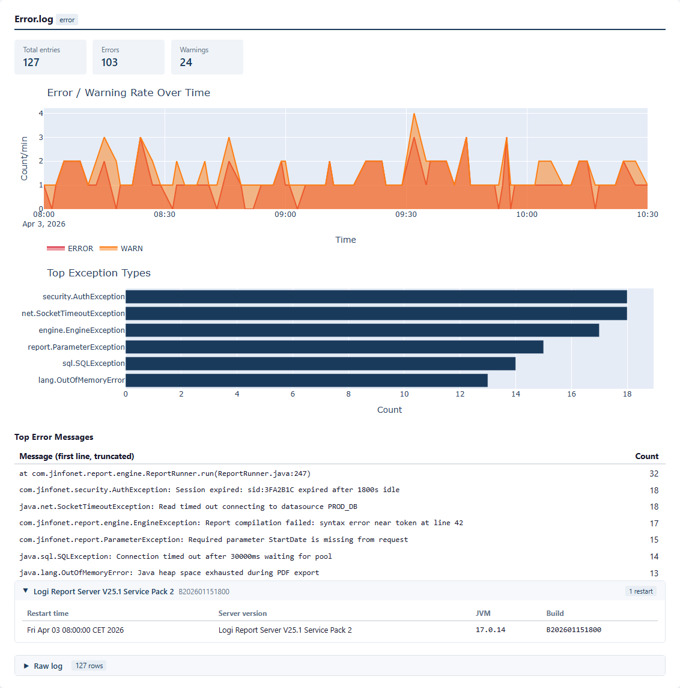
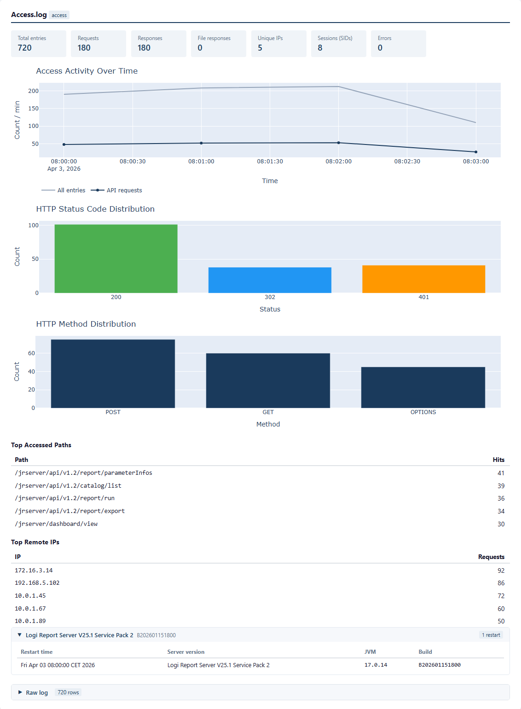
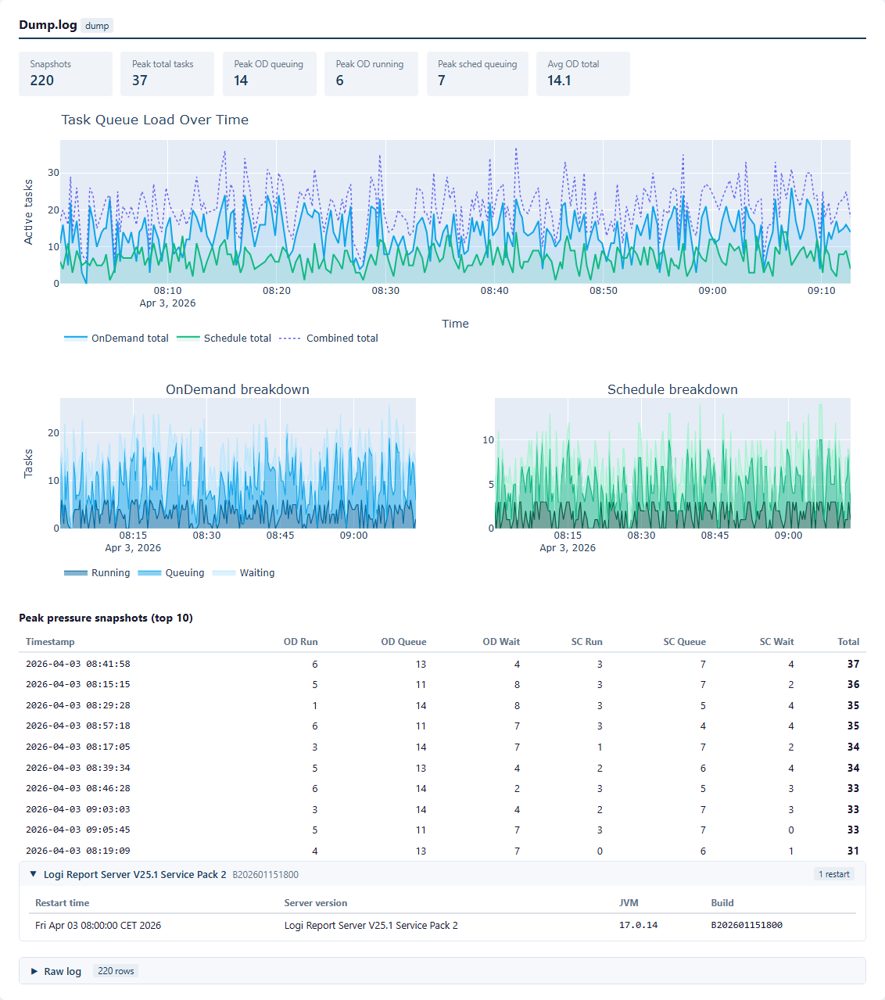
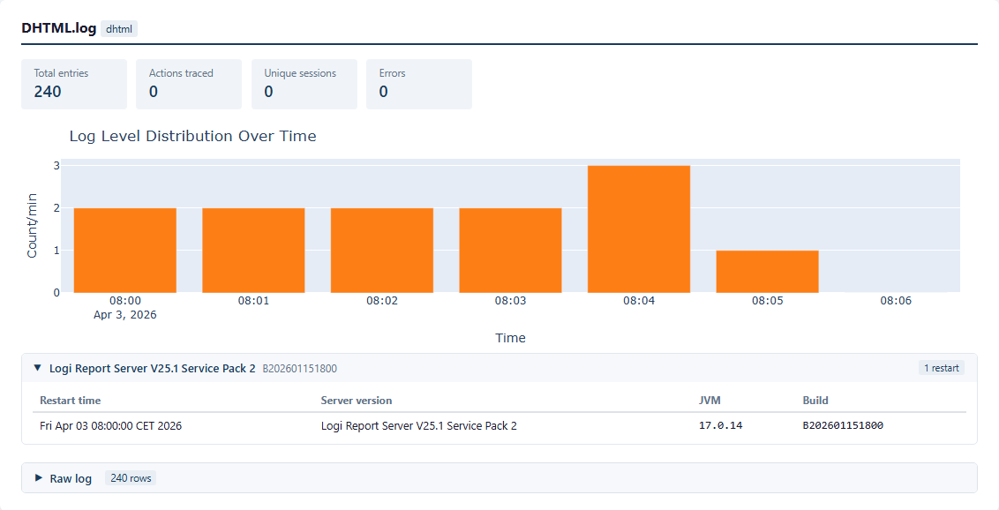
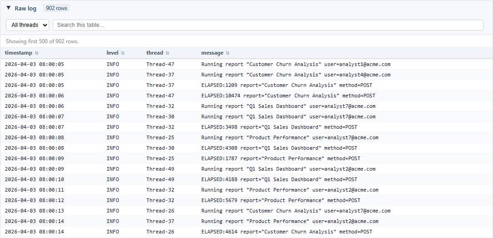
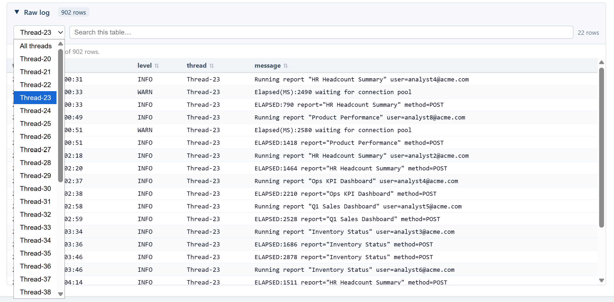

# LogiLyzer

A local web tool for support engineers working with **Logi Report Server** log files. Upload a customer's logs, get interactive charts and a filterable raw-log table, export a self-contained HTML report you can attach to a ticket or share with the team — no installation required on the customer's side, nothing uploaded to the cloud.

---

## Why this tool

Reading raw `.log` files to diagnose a performance issue or track down an error is slow and error-prone. This tool turns a folder of log files into:

- **Timeline charts** — see exactly when errors spiked, when queue depth grew, or when a slow action started
- **Per-log analytics** — each log type gets charts tailored to what it captures (elapsed times, queue depth, HTTP activity, exception breakdowns, etc.)
- **Filterable raw log** — search, filter by level/thread, sort columns — without leaving the browser
- **Server version badge** — immediately see which Logi Report version the customer is running
- **Exportable report** — one self-contained HTML file you can attach to a Zendesk/Jira ticket

---

## Supported log types

| Log file | What you see |
|----------|-------------|
| `Engine.log` | Operation elapsed times scatter, thread activity, level distribution |
| `DHTML.log` | Action cost over time, slowest-actions table (count / avg / P95 / max) |
| `Access.log` | Request/response volume, HTTP status codes, method distribution, top IPs & paths |
| `Error.log` | Error rate timeline, exception class breakdown, top error messages table |
| `Dump.log` | OnDemand & Scheduled task queue depth (Running / Queuing / Waiting) |
| `Performance.log` | Operation elapsed times (same view as Engine) |
| `Debug.log` | Level distribution over time |
| `Event.log` | Level distribution over time |
| `Manage.log` | Level distribution over time |
| `Page Report.log` | Level distribution over time |

---

## Screenshots

### Full UI — sidebar, version badges, log-level filters



### Sidebar filters — level toggles and global search (INFO off, showing only ERROR/WARN)



### Engine.log — elapsed time scatter, level distribution, active threads



### Error.log — error/warning rate timeline, exception breakdown, top messages



### Access.log — request volume, HTTP status codes, method distribution



### Dump.log — queue depth (Running / Queuing / Waiting), OnDemand vs Scheduled, peak pressure table



### DHTML.log — action cost scatter, slowest-actions table, server restart info



### Raw log table — sortable columns, search, thread dropdown



### Raw log filtered — level toggles + thread filter applied (Only show Thread-23)



---

## Quickstart with Docker

No Python installation required.

```bash
git clone https://github.com/asinay/logilyzer.git
cd logilyzer
docker compose up
```

Open [http://localhost:8000](http://localhost:8000). Exported reports are saved to `./outputs/` on your machine.

---

## Setup (one-time)

Requires **Python 3.9+**.

```bash
# Clone or download this repo, then:
python -m venv .venv

# Windows
.venv\Scripts\activate

# macOS / Linux
source .venv/bin/activate

pip install -r requirements.txt
```

## Run

```bash
# Activate venv first, then:
uvicorn app:app --host 127.0.0.1 --port 8000
```

Open [http://127.0.0.1:8000](http://127.0.0.1:8000).

---

## Typical support workflow

1. Ask the customer to send all `.log` files from `<install_root>\logs\` (see [Enabling logging](docs/enabling-logging.md) if they haven't configured logging yet)
2. **Upload** — drag and drop all files at once; log type is auto-detected from filename
3. **Filter** — the time range pre-fills from the actual timestamps in the files; narrow it to the incident window if needed
4. **Export** — downloads a self-contained `.html` report
5. Attach the report to the ticket, or open it locally to investigate

The report includes a **server version pill** on each file in the sidebar — useful when a customer sends logs from multiple servers or a version-upgrade scenario.

---

## Sample report

[`demo/sample_report.html`](demo/sample_report.html) is a pre-generated example built from synthetic log data covering Engine, Error, Access, Dump, and DHTML logs. Open it locally in any browser to see what the output looks like before running the tool.

To regenerate it:

```bash
python scripts/generate_demo.py
```

## Enabling logging on the customer's server

If a customer hasn't configured logging, point them to **[docs/enabling-logging.md](docs/enabling-logging.md)** or the in-app help page (`❓ How to enable logging` button).

Minimum recommended setup: **Engine, Error, Access, DHTML, Dump** at `INFO` level with a `RollingFile` appender (`50MB` max size, 3 backups).

---

## Notes

- All processing is local — no data leaves your machine
- Reports are also saved to `outputs/` for later reference
- Files with 0 parsed rows (empty or header-only) appear in the list but produce no charts
- Multiple files can be uploaded in one batch; use the checkboxes to include/exclude per file
